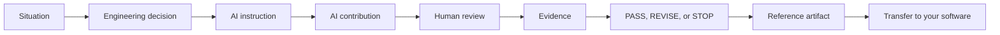

# PetClinic Engineering Journey

This is the primary learning path for the companion repository.

The primary case is **PLC-VRL-001**, the per-pet visit-booking rate limiter.
Use the [ordered primary-case artifact index](../docs/primary-case-artifacts.md)
for the concrete manuscript journey. The numbered stage pages below remain
available as reader exercises; their original reminder examples are explicitly
secondary and must not be mistaken for the primary case.

## PetClinic Lifecycle Case

The canonical journey identity is **PLC-VRL-001 — PetClinic Lifecycle Case**:
the per-pet visit-booking rate limiter. Follow this same case from context and
requirements through implementation, evidence, security, delivery, release,
operation, later change, and the bounded retirement example. The secondary
reminder capability supplies additional operational practice but is not a
replacement lifecycle thread.

The objective is not to copy a finished application. The objective is to complete one bounded engineering delivery while learning how a human engineer and an AI contributor work together.

The supplied implementation uses Java and Spring Boot, but the journey does
not require either. Follow the PetClinic path when you want a reproducible
reference. Use your own software when transfer matters more than matching the
example. In either case, preserve the decisions, contribution boundaries,
verification, acceptance, and retained learning.

Follow the primary artifacts in order:

1. [Capability request and requirements challenge](../artifacts/requirements/visit-rate-limiter-request.md)
2. [Spec Invariants](../ai/specs/visit-rate-limiter-invariants.md)
3. [Context Package](../ai/context/visit-rate-limiter-context-package.yaml)
4. [ADR-004](../ai/memory/adr-004-visit-rate-limiting.md)
5. [Work Package and Plan Receipt](../artifacts/work-packages/visit-rate-limiter-work-package.md)
6. [Contribution Contract and AI instruction](../ai/contracts/visit-rate-limiter-contribution.yaml)
7. [Implementation](../src/main/java/org/springframework/samples/petclinic/owner/VisitRateLimiter.java) and [tests](../src/test/java/org/springframework/samples/petclinic/owner/VisitRateLimiterIntegrationTests.java)
8. [Review and correction](08-review-and-correction/visit-rate-limiter-correction-contract.md)
9. [Verification](../ai/evidence/visit-rate-limiter-verification.json), [functional evidence](../artifacts/evidence/visit-rate-limiter-functional-evidence.md), and [acceptance](../artifacts/acceptance/visit-rate-limiter-acceptance-record.md)
10. [Security](../artifacts/security/visit-rate-limiter-security-assessment.md), [release](../docs/delivery-evidence.md), [operations](../artifacts/operations/visit-rate-limiter-runbook.md), and [learning](../artifacts/lessons/visit-rate-limiter-lifecycle-assessment.md)

For the secondary reminder exercises, use [Context](01-context/README.md),
[Requirements](02-requirements/README.md), [Architecture](03-architecture/README.md),
[Planning](04-planning/README.md), [Contribution Contract](05-contribution-contract/README.md),
[Implementation](06-implementation/README.md), [Verification](07-verification/README.md),
[Review and Correction](08-review-and-correction/README.md), [Security and Permissions](09-security-and-permissions/README.md),
and [Release and Recovery](10-release-and-recovery/README.md).

After release and recovery, compare the delivery evidence in
`../docs/delivery-evidence.md` and the bounded retirement decision in
`../artifacts/retirement/retirement-decision.md`. These records make the
delivery gate and lifecycle closure explicit without claiming production
decommissioning.

Each stage follows the same learning cycle:

Do not read the reference artifact first. Make the decision, use the AI instruction, review the result, and then compare.

## Evidence labels

- **Established Engineering Evidence**: supported by cited standards or established literature.
- **Verified Reference Implementation**: implemented and verified in this repository.
- **Recorded Engineering Journey**: a decision, contribution, failure,
  correction, or limitation supported by project artifacts. The project may
  still be in development; the evidence supports only the event and outcome
  actually recorded.
- **Educational Replay**: executed later to reconstruct a learning sequence under recorded conditions.
- **Illustrative Example**: explanatory material that was not executed.

See [Evidence Provenance](../docs/evidence-provenance.md).

## Engineering notebook

Record short answers in [Engineering Notebook](engineering-notebook.md). The notebook is for your judgment, not for producing more documentation.
